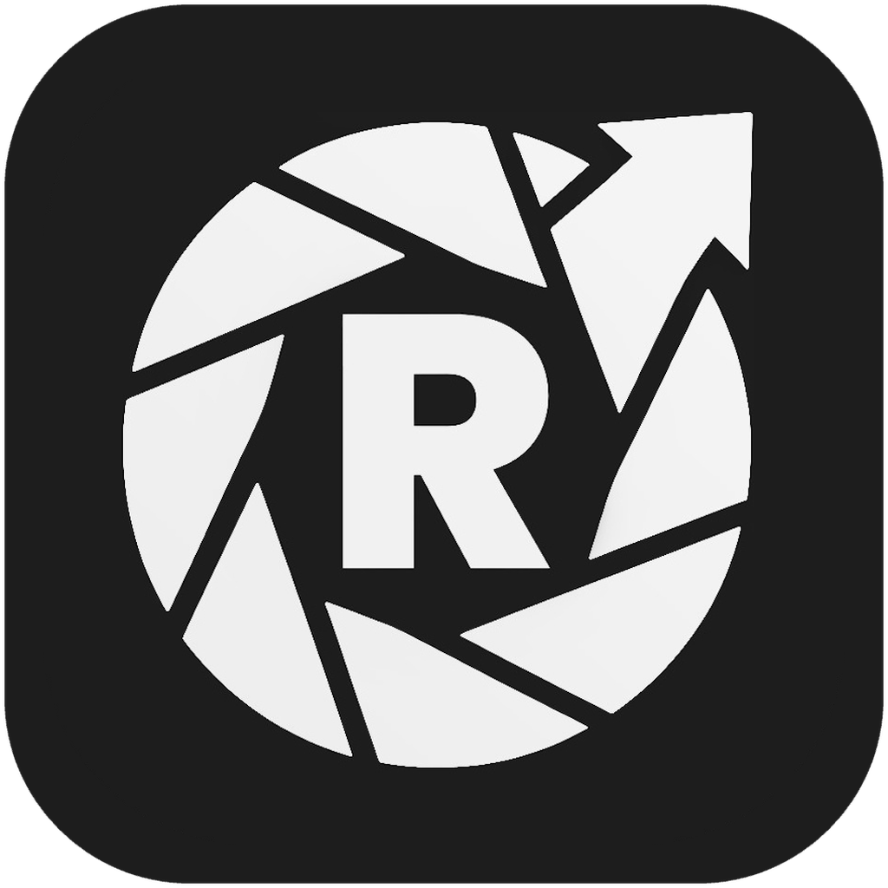
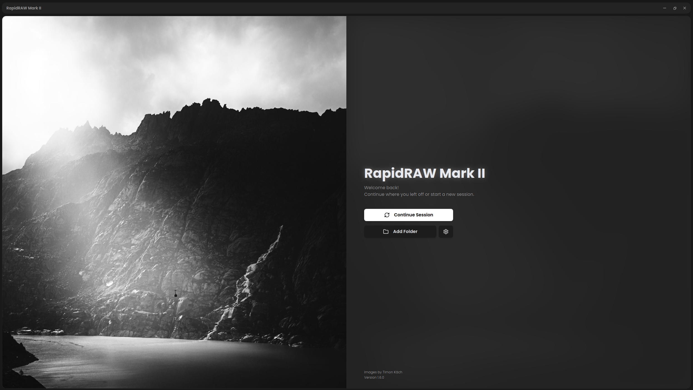
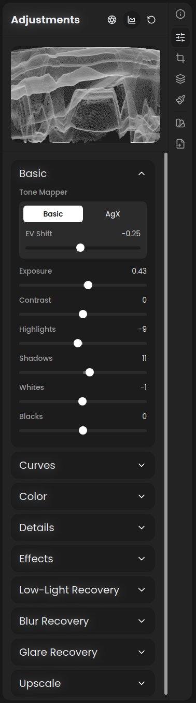

<div align="center">



# RapidRAW Mark II

**Recovery-driven RAW editing for adverse field conditions.**

<sub>RECOVERY &nbsp;/&nbsp; INSPECTION &nbsp;/&nbsp; CONTEXT</sub>

<br><br>

[](https://github.com/RustRunner/RapidRAW-MKII/tags)
[](https://github.com/RustRunner/RapidRAW-MKII/actions/workflows/windows-release.yml)
[](LICENSE)
[](https://github.com/CyberTimon/RapidRAW)

[Source milestones](https://github.com/RustRunner/RapidRAW-MKII/tags) · [MKII changes](#what-mark-ii-changes) · [Build from source](#build-from-source) · [Original RapidRAW](https://github.com/CyberTimon/RapidRAW)

</div>

<p align="center">
  
  <br>
  <sub>RapidRAW Mark II welcome screen — a focused entry point for continuing a session or opening a new folder.</sub>
</p>

> [!IMPORTANT]
> **Upstream credit:** RapidRAW Mark II is an independent fork of [RapidRAW](https://github.com/CyberTimon/RapidRAW) by [Timon Käch (CyberTimon)](https://github.com/CyberTimon). RapidRAW provides the core editor, GPU pipeline, and masking system. Mark II is maintained separately by [RustRunner](https://github.com/RustRunner) and focuses exclusively on the recovery and inspection features detailed below.

## Operational Focus

Mark II is engineered for degraded source material where positive identification and contextual awareness are critical. It retains RapidRAW's fast, non-destructive workflow while introducing a disciplined, inspection-driven UI and a dedicated recovery stack tailored for challenging field conditions.

<table>
  <tr>
    <td width="68%" valign="top">
      <h3>Built for Difficult Captures</h3>
      <p>Built around a true accordion UI, the adjustment panel preserves familiar photographic controls while introducing a dedicated recovery stack. These specialized tools are arranged in a methodical sequence, promoting a disciplined, step-by-step approach to image restoration.</p>
      <ul>
        <li><strong>Artifact Suppression:</strong> Suppress sensor noise and hot pixels to recover baseline detail from low-light, high-ISO environments.</li>
        <li><strong>Blur Correction:</strong> Correct motion, defocus, or Gaussian blur in the frequency domain to stabilize dynamic or rushed captures.</li>
        <li><strong>Environmental Mitigation:</strong> Estimate and reduce veiling glare caused by harsh lighting or shooting through glass barriers.</li>
        <li><strong>Actionable Export:</strong> Validate changes using split-screen inspection, then export with embedded operational notes and precise location data.</li>
      </ul>
      <p><strong>Zero-Telemetry & Air-Gapped:</strong> Mark II is designed to operate completely off-grid. All account requirements and hosted AI telemetry have been stripped. Optional AI models must be supplied by the operator and loaded directly from a local directory for secure, offline processing.</p>
    </td>
    <td width="32%" align="center" valign="top">
      
      <br>
      <sub>The MKII recovery stack.</sub>
    </td>
  </tr>
</table>

## What Mark II changes

| Area                    | MKII-specific direction                                                                                                                                             |
| ----------------------- | ------------------------------------------------------------------------------------------------------------------------------------------------------------------- |
| **Low-Light Recovery**  | Live hot-pixel removal and denoising driven by measured image noise, with separate chroma smoothing and detail preservation.                                        |
| **Blur Recovery**       | FFT Wiener deconvolution for motion, defocus, and Gaussian blur; includes blur estimation, interactive direction control, presets, and artifact suppression.        |
| **Glare Recovery**      | Estimates and subtracts smooth veiling glare while limiting local contrast boost; the estimated veil can be displayed for inspection.                               |
| **Inspection workflow** | A true accordion adjustment panel with Basic open by default, plus a split-view comparison mode for checking processed detail against the source.                   |
| **Contextual export**   | Configurable callout boxes with notes, metadata prefill, optional MGRS coordinates, saved templates, placement, spacing, and opacity controls.                      |
| **Output tools**        | One-step 2× Lanczos upscaling that saves a new file beside the original.                                                                                            |
| **GPU resilience**      | VRAM-aware recovery, tile-local allocations, scaled fallbacks, tuned export workers for integrated GPUs, clearer GPU errors, and a Windows backend fallback ladder. |
| **Local-first surface** | Self-hosted fonts, a strict webview content security policy, local user-provided AI models, and removal of remote account/provider and community-preset code.       |

## Versions and builds

Versioned MKII source milestones are published under [Tags](https://github.com/RustRunner/RapidRAW-MKII/tags). The Windows tag workflow prepares installer artifacts and draft GitHub Releases; published packages will appear on the [Releases page](https://github.com/RustRunner/RapidRAW-MKII/releases). Until a package is published for your platform, build the `mkii` branch from source.

For the mainstream project, its latest features, and its official packages, use the [original RapidRAW releases](https://github.com/CyberTimon/RapidRAW/releases).

## Build from source

Install the [Tauri 2 prerequisites](https://v2.tauri.app/start/prerequisites/) for your platform, [Node.js 22](https://nodejs.org/), and the [stable Rust toolchain](https://www.rust-lang.org/tools/install).

```bash
git clone --branch mkii --single-branch https://github.com/RustRunner/RapidRAW-MKII.git
cd RapidRAW-MKII
npm ci
npm start
```

Useful development checks:

```bash
npm run typecheck
npm run lint
npm run build
```

MKII inherits RapidRAW's Windows, macOS, Linux, and Android architecture. The recovery pipeline is GPU-intensive; a modern WGPU-compatible adapter and 16 GB of system memory are recommended for large RAW files. Integrated GPUs are supported with reduced worker and VRAM budgets, but processing speed varies by image size and adapter.

## Contributing

Bug reports and focused pull requests are welcome in this repository. Please target the `mkii` branch and note whether an issue affects an MKII recovery feature or can also be reproduced in upstream RapidRAW. General RapidRAW fixes may be better contributed directly to the [upstream issue tracker](https://github.com/CyberTimon/RapidRAW/issues).

When reporting recovery problems, include the operating system, GPU/driver, source dimensions and format, selected WGPU backend, and the smallest set of adjustment values that reproduces the result. Share sample images only when you have permission to do so.

## Attribution and license

- **Original project:** [RapidRAW](https://github.com/CyberTimon/RapidRAW) by [Timon Käch](https://github.com/CyberTimon)
- **Mark II fork and recovery-focused changes:** [RustRunner/RapidRAW-MKII](https://github.com/RustRunner/RapidRAW-MKII)
- **Original acknowledgements:** See RapidRAW's [Special Thanks](https://github.com/CyberTimon/RapidRAW#special-thanks) for the projects and research that underpin the editor.

RapidRAW Mark II remains licensed under the [GNU Affero General Public License v3.0](LICENSE). Copyright in the original work and subsequent modifications belongs to the respective contributors. Preserve the license and existing notices when redistributing modified builds.
